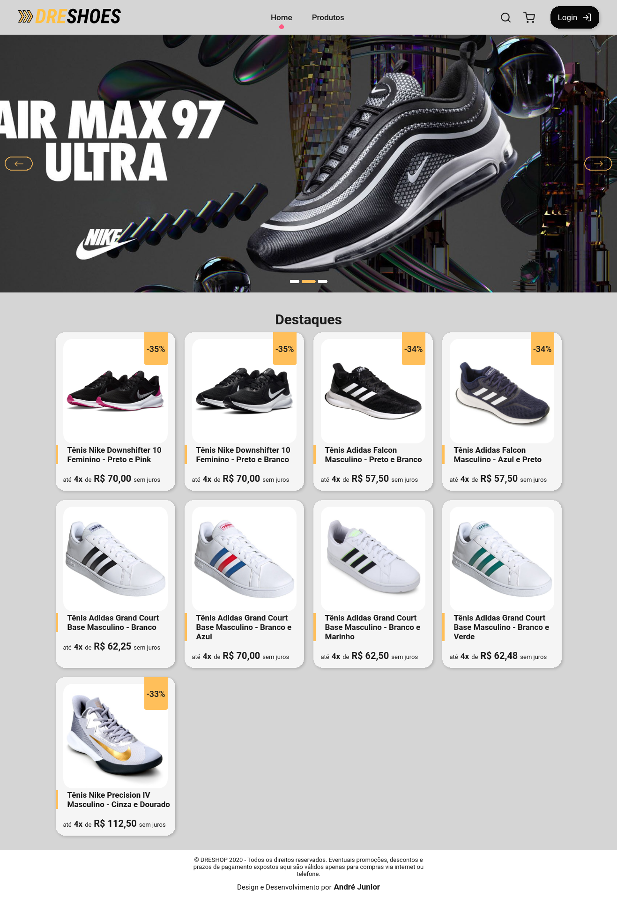
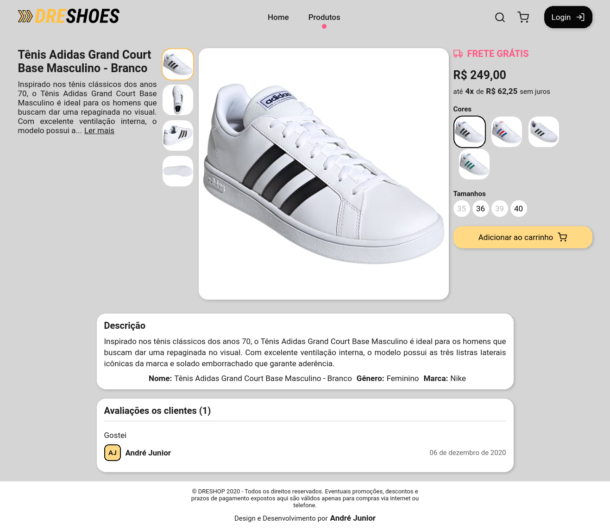
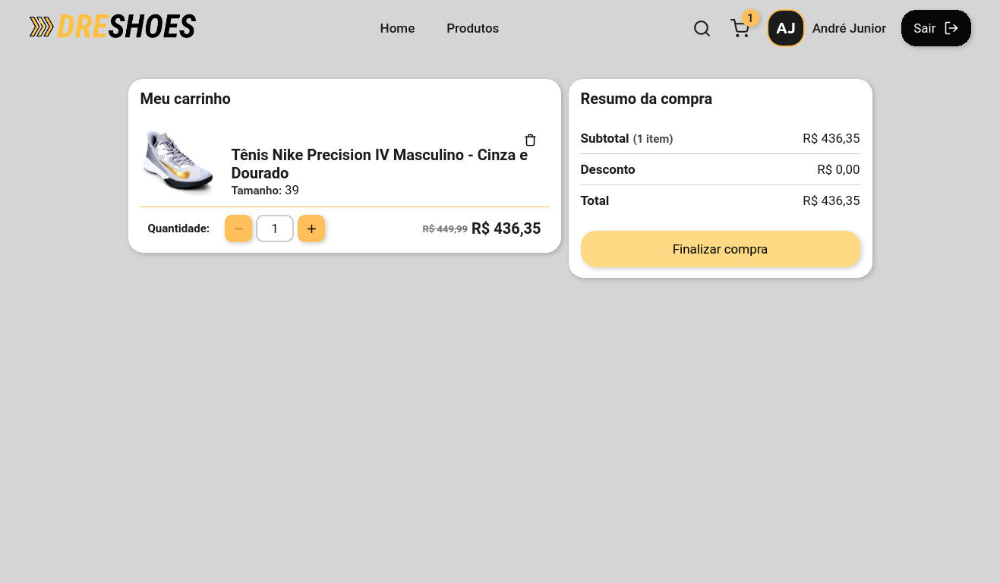

<h1 align="center">
    
</h1>

  <a href="#-tecnologias">Tecnologias</a>&nbsp;&nbsp;&nbsp;|&nbsp;&nbsp;&nbsp;
  <a href="#-projeto">Projeto</a>&nbsp;&nbsp;&nbsp;

 

  

## 🚀 Tecnologias

Esse projeto foi desenvolvido com as seguintes tecnologias:

- [React](https://reactjs.org)
- [StyledComponents](https://styled-components.com)
- [Typescript](https://www.typescriptlang.org/)
- [Unform](https://unform.devg)
- [ESLint](https://eslint.org)
- [Prettier](https://prettier.io)

## 💻 Projeto

Este projeto foi proposto pelo professor [Fernando Leonid](https://github.com/fernandoleonid) da disciplina de DS da FATEC de São Roque,
para obtenção de nota da P3. A finalidade desta atividade era construir uma api em PHP de 
um ecommerce, com cadastro de clientes, produtos e usuários. E para consumir essa api,
fomos livres pra escolher a tecnologia.

Link para o [dashboard](https://github.com/andrejr971/dashboard-ecommerce)

Link para o [backend](https://github.com/andrejr971/ecommerce-php)

  

  

---

Feito by André Junior :wave: [portifólio](https://andrejr.dev)